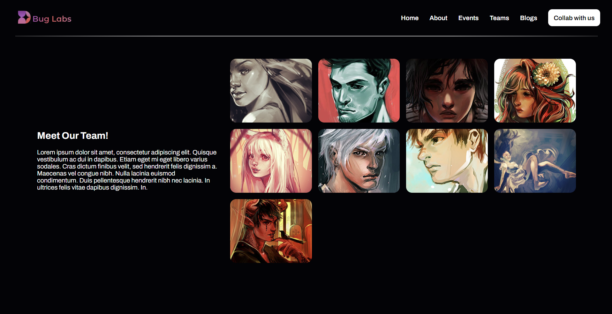

# Gallery Project

## Description

The Gallery Project has evolved into a dynamic and responsive showcase of artworks, now powered by React and styled with Tailwind CSS. Embracing the capabilities of React for component-based architecture and Tailwind for utility-first CSS, this version offers an enhanced user interface and an even more flexible layout system.

## Features

- **React Integration**: Utilizes React for efficient UI updates and state management, offering a more interactive experience.
- **Tailwind CSS Styling**: Leveraging Tailwind CSS for rapid UI development, ensuring a highly customizable and responsive design.
- **Dynamic Content Management**: Easily manage and display artworks with React's component-based structure, allowing for dynamic content updates.
- **Responsive and Adaptive Design**: The gallery remains responsive and adaptive, with Tailwind CSS's mobile-first approach ensuring compatibility across devices.
- **Modern Development Workflow**: Combining React's powerful ecosystem with Tailwind's utility classes promotes a streamlined and efficient development process.

## Installation

1. Clone the repository to your local machine.
2. Navigate to the project directory and install dependencies with `npm install`.
3. Start the development server with `npm start`. The project will open in your default web browser at `http://localhost:3000`.

## Usage

Navigate through the gallery using intuitive UI controls. The React-based architecture allows for seamless browsing and interaction with the artworks.

## Contributing

Contributions are highly appreciated! If you wish to contribute, please fork the repository and submit a pull request with your proposed changes. Ensure your contributions adhere to the current coding standards and include comprehensive documentation.

## Credits

- Artwork images sourced from [Mernan Behairi]()
- Developed with ❤️ by [Shyam Jaiswal](https://github.com/jaiswalism), now incorporating React and Tailwind CSS for a modernized approach.

